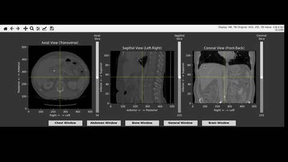

# Medical Image Viewer (Matplotlib MPR)

## medview-python



A powerful, interactive medical image viewer for DICOM, NIfTI, and MetaImage files, supporting Multi-Planar Reconstruction (MPR) directly using Matplotlib(python).

# Features
- View 3D medical images from three anatomical planes: Axial, Coronal, Sagittal
- Scroll through slices in any view (mouse wheel or slider)
- Click to synchronize crosshairs and views at any 3D location
- Interactive crosshairs across all views
- CT windowing controls (for CT images)
- Supports DICOM series (folder), NIfTI (.nii, .nii.gz), and MetaImage (.mha)


# Controls
- **Scroll**: Use mouse wheel or vertical slider to move through slices.
- **Click**: Click on any view to move the crosshairs and synchronize all views to that 3D location.
- **CT Window**: For CT images, use the window buttons to change window/level.


## Requirements
- Python 3.7+
- matplotlib
- numpy
- SimpleITK (for image reading)


# Setup Instructions

1. **Clone the Repository**
   ```bash
   git clone https://github.com/medsee-labs/medview-python.git
   cd medview-python
   ```

2. **Create and Activate a Virtual Environment**
   ```bash
   python3 -m venv venv
   source venv/bin/activate
   ```

3. **Install the Package and Dependencies**
   ```bash
   pip install --upgrade pip
   pip install .
   ```


# Usage

After installation, you can launch the viewer from the command line.

## Command Syntax
### Using the installed command (after setup.py installation):
```bash
medview <image_path> [--modality MODALITY]
```

### Using the Python script directly:
```bash
python3 medview/medical_viewer_matplot.py <image_path> [--modality MODALITY]
```

## Parameters

- **`<image_path>`** (required): Path to your medical image
  - DICOM folder (directory containing `.dcm` files)
  - NIfTI file (`.nii` or `.nii.gz`)
  - MetaImage file (`.mha`)

- **`--modality`** (optional): Imaging modality type
  - Examples: `CT`, `MRI`, `PET`, `US`
  - If not specified, will be automatically inferred when possible

## Examples

### View a DICOM series (folder) - Repo example
```bash
python3 medview/medical_viewer_matplot.py sample_data/MRI/S10_anonymised_dicom --modality MRI
```

Or with installed command:
```bash
medview sample_data/MRI/S10_anonymised_dicom --modality MRI
```

### View a NIfTI file
```bash
python3 medview/medical_viewer_matplot.py /path/to/image.nii.gz
```

Or with installed command:
```bash
medview /path/to/image.nii.gz
```

### View a DICOM series (folder)
```bash
python3 medview/medical_viewer_matplot.py /path/to/dicom_folder --modality CT
```

Or with installed command:
```bash
medview /path/to/dicom_folder --modality CT
```

### View a MetaImage file with modality
```bash
python3 medview/medical_viewer_matplot.py /path/to/scan.mha --modality CT
```

Or with installed command:
```bash
medview /path/to/scan.mha --modality CT
```


## Notes
- For DICOM, provide the path to the folder containing the DICOM files (not a single file)
- For NIfTI or MetaImage, provide the path to the file
- The viewer will print image info and open an interactive window

## Troubleshooting
- If you see errors about missing files or series, check your path and file types
- For DICOM, ensure the folder contains valid DICOM files


## Using MedView in Jupyter Notebooks

You can use MedView interactively within Jupyter notebooks for exploratory analysis.

### Example Notebooks

Check out these complete examples in the `notebooks/` directory:

- **[`notebooks/plot_med_images_tutorial.ipynb`](notebooks/plot_med_images_tutorial.ipynb)** - Complete tutorial on plotting medical images
- **[`notebooks/tcia_load.ipynb`](notebooks/tcia_load.ipynb)** - Loading images from The Cancer Imaging Archive (TCIA)

### Setup
1. **Install Jupyter and matplotlib widget support:**
   ```bash
   pip install notebook ipympl
   ```
2. **Start Jupyter Notebook:**
   ```bash
   jupyter notebook
   ```


# License
MIT 